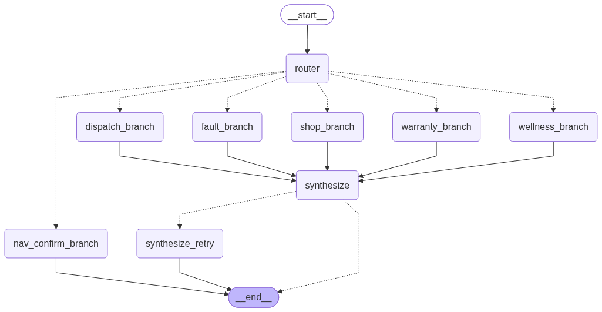

# Elmeeda VocalCoord

> AI voice co-pilot for long-haul truck drivers — hands-free fault response, shop booking, warranty lookup, HOS compliance, and dispatch notification in under 10 seconds.

**Status:** fixture data layer (shops, warranty, dispatch); provider interfaces defined for swapping in Samsara / Google Places / McLeod. See [`docs/adr/`](docs/adr/) for design decisions.

---

## The Problem

A truck driver on a 500-mile run hits a DEF system fault. To handle it properly they need to:

1. Decode the J1939 fault code
2. Find a certified shop nearby with the part in stock
3. Check if the repair is under warranty
4. Verify they have enough hours-of-service left
5. Notify dispatch of the delay

That's four separate tasks — none of which can be done safely while driving. **VocalCoord does all of it in a single voice exchange.**

---

## Demo

```
Driver:  "I've got SPN 4334 FMI 18, I'm near Columbus, 3 hours left on my clock, running load FRT-28470."

System:  "Your DEF pump is failing — engine will derate in ~50 miles. Bay booked at Freightliner of
          Columbus, 12 miles ahead at 2 PM. Repair is covered under the EPA Emissions Warranty at no
          cost to you. Dispatch notified on FRT-28470 with a 4-hour delay. Ready to set nav — yes or no?"
```

Four agents. One voice reply. Hands never leave the wheel.

---

## Architecture



```
ElevenLabs Voice (STT fallback + TTS)  ──  Owned STT: POST /stt (Faster-Whisper small.en, VAD-gated)
         │ webhook (tool call: trigger_fault_response | confirm_nav_yes_no)
         ▼
   FastAPI Backend
         │
         ▼
   LangGraph: router ──► one branch per intent ──► synthesize ──► (synthesize_retry) ──► END
                         fault │ wellness │ warranty │ dispatch │ shop │ nav_confirm
                         (MemorySaver checkpoint per conversation)
                         │
                         ▼
               Template-first reply (no LLM on the common path)
               OOD only → owned LLM (Ollama qwen2.5:3b, Anthropic fallback)
                         │
                         ▼ SSE stream
               Next.js Dashboard (real-time)
```

**Frontend** streams every agent event via Server-Sent Events — the Mission Control panel shows the full pipeline firing in real time, making the invisible visible for demos and fleet managers. See [`docs/architecture.mmd`](docs/architecture.mmd) for the diagram source and [`docs/adr/0005-hybrid-owned-stt-llm.md`](docs/adr/0005-hybrid-owned-stt-llm.md) for the HYBRID decision.

**Frontend** streams every agent event via Server-Sent Events — the Mission Control panel shows the full pipeline firing in real time, making the invisible visible for demos and fleet managers.

---

## Stack

| Layer | Technology |
|---|---|
| Voice TTS | ElevenLabs Conversational AI (`PROVIDER_TTS=elevenlabs`, Piper reserved) |
| Owned STT | Faster-Whisper `small.en` via `POST /stt` (16 kHz WAV, Silero VAD) |
| Backend | Python 3.11, FastAPI, uvicorn |
| Agent orchestration | LangGraph (branched, `MemorySaver` checkpoint) |
| LLM (OOD synthesis only) | Ollama `qwen2.5:3b` local (`PROVIDER_LLM=local`) with Anthropic fallback; `anthropic` default |
| Real-time events | SSE (sse-starlette) |
| Frontend | Next.js 16, React 19, TypeScript |

---

## Project Structure

```
elmeeda-vocalcoord/
├── backend/
│   ├── main.py                  # FastAPI server, webhook handler, /stt endpoint, SSE stream
│   ├── graph.py                 # LangGraph: router + branch per intent + synthesize_retry, MemorySaver
│   ├── llm.py                   # Owned LLM: Ollama local with Anthropic fallback
│   ├── stt.py                   # Owned STT: Faster-Whisper + VAD + p50/p95 metrics
│   ├── events.py                # Per-conversation async event queues
│   ├── models.py                # Pydantic models
│   ├── agents/
│   │   ├── orchestrator.py      # Intent classification + routing map (incl. nav_confirm)
│   │   ├── nav_confirm.py       # Second-turn yes/no handler (multi-turn gate)
│   │   ├── shop_caller.py       # Nearest certified shop with part availability
│   │   ├── warranty_scout.py    # Warranty coverage lookup by fault code
│   │   ├── wellness_copilot.py  # FMCSA HOS compliance check (5 severity tiers)
│   │   ├── dispatch_relay.py    # Delay notification with severity-based ETA
│   │   └── response.py          # Template-first voice reply synthesizer (LLM only for OOD)
│   ├── tools/
│   │   ├── j1939.py             # SAE J1939 fault code parser (SPN/FMI)
│   │   ├── shop_db.py           # Shop search and ranking
│   │   └── warranty_db.py       # Warranty claims lookup
│   ├── data/
│   │   ├── fault_codes.json     # J1939 SPN lookup table (10 codes)
│   │   ├── shops.json           # Shop database (6 Columbus-area shops)
│   │   └── warranty_parts.json  # Warranty policies (4 coverage types)
│   └── tests/                   # pytest + pytest-asyncio (branch + STT coverage incl.)
│
├── scripts/
│   ├── eval_latency.py          # 20-utterance latency eval (p50/p95, template-hit, HOS table)
│   └── render_graph.py          # Renders docs/architecture.mmd + docs/architecture.png
│
└── frontend/
    ├── app/
    │   ├── page.tsx             # Root (force-dynamic)
    │   ├── layout.tsx           # Global layout
    │   └── HomeClient.tsx       # Split-screen container + auto-end logic
    ├── components/
    │   ├── DriverView/          # Fault banner, audio visualizer, mic button
    │   └── MissionControl/      # Agent pipeline, event log, voice reply panel
    ├── hooks/
    │   ├── useConversation.ts   # ElevenLabs SDK wrapper
    │   └── useAgentEvents.ts    # SSE listener + state reducer
    └── types/
        └── events.ts            # Shared event + agent state types
```

---

## Getting Started

```bash
git clone https://github.com/Pranavk098/elmeeda-vocalcoord.git
cd elmeeda-vocalcoord
docker compose up --build   # backend on :8000, frontend on :3000
```

Needs `backend/.env` and `frontend/.env.local` populated first — see
[`CONTRIBUTING.md`](CONTRIBUTING.md) for the full local setup (Python/Node
install without Docker, environment variables, ElevenLabs agent
configuration, and running tests).

CI (`.github/workflows/ci.yml`) runs the backend pytest suite and a frontend
type-check + build on every push/PR to `master`.

---

## How It Works

### Fault Flow

1. Driver speaks → owned STT (`POST /stt`, Faster-Whisper) or ElevenLabs STT extracts intent + parameters
2. ElevenLabs calls the `trigger_fault_response` webhook on the backend
3. Backend emits `fault_detected` SSE event → dashboard lights up
4. LangGraph router classifies intent and takes the matching branch node —
   `fault_branch` fires four agents **in parallel** via `asyncio.gather`:
   - **Shop Caller** — filters shops by distance, part availability, certification
   - **Warranty Scout** — maps SPN → warranty code → coverage + claim value
   - **Wellness Co-Pilot** — evaluates HOS against 5 FMCSA rule tiers
   - **Dispatch Relay** — builds delay payload (severity-based: +4hr red, +2hr yellow)
   Single-intent tools (`request_wellness_check`, `query_warranty`,
   `update_dispatch`, `shop_search`) run only their branch's agent — no LLM.
5. Template-first reply renders from structured state (no LLM on the common
   path); OOD states synthesize via owned Ollama with Anthropic fallback,
   with `synthesize_retry` + degraded template as the safety net
6. ElevenLabs TTS speaks the reply; the driver's spoken "yes/no" arrives as a
   second tool call (`confirm_nav_yes_no`) through the `nav_confirm` branch —
   a real turn, not a re-trigger — and the session ends after the nav turn

### Re-trigger Protection

ElevenLabs can re-fire the tool if the driver says anything after the reply (yes/no, background noise). The backend caches the completed reply per conversation ID and returns it instantly on repeat calls — no agents re-run, no duplicate SSE events. The `confirm_nav_yes_no` tool bypasses this cache: nav answers always take the `nav_confirm` branch and emit `nav_confirmed`, so "yes" sets nav instead of replaying the fault reply.

### HOS Tiers (FMCSA 49 CFR Part 395)

| Remaining | Status | Action |
|---|---|---|
| < 1.0 hr | CRITICAL | Cannot legally drive after stop — 10-hr reset required |
| 1.0–2.0 hrs | SEVERE | Repair exhausts HOS — coordinate reset location |
| 2.0–3.5 hrs | CAUTION | Tight margin — flags 30-min break rule |
| 3.5–6.0 hrs | WATCH | Enough room — reminds about 8-hr continuous limit |
| ≥ 6.0 hrs | CLEAR | HOS not a constraint |

---

## Latency eval (`scripts/eval_latency.py`)

20 scripted fault utterances through the real webhook → graph → template path
(in-process, no API key needed — all cases hit the template fast path by
construction). Regenerate with `python scripts/eval_latency.py` from the repo root.

| Metric | Value (2026-09-06, CPU, in-process, after warmup) |
|---|---|
| Webhook-to-reply p50 | ~156 ms |
| Webhook-to-reply p95 | ~160–190 ms (machine-load dependent) |
| Mean / max | ~155 ms / ~190 ms |
| Template-hit rate | 20/20 (100%) |
| HOS-tier correctness | 20/20 (100%) |

| Tier | Correct |
|---|---|
| CRITICAL (< 1 hr) | 5/5 |
| SEVERE (1–2 hrs) | 3/3 |
| CAUTION (2–3.5 hrs) | 3/3 |
| WATCH (3.5–6 hrs) | 4/4 |
| CLEAR (≥ 6 hrs) | 5/5 |

> In-process timings exclude network STT/TTS and ElevenLabs round-trips.
> Owned-STT latency is tracked separately per trace via `POST /stt`
> (`stt_ms` + rolling p50/p95 in the `stt_complete` audit event).

---

## HYBRID provider flags

| Variable | Values | Default | Effect |
|---|---|---|---|
| `PROVIDER_LLM` | `anthropic` \| `local` | `anthropic` | `local` tries Ollama `qwen2.5:3b` (`OLLAMA_HOST`/`OLLAMA_MODEL`) first, Anthropic fallback |
| `PROVIDER_TTS` | `elevenlabs` \| `piper` | `elevenlabs` | ElevenLabs path unchanged; `piper` reserves the owned route |
| `STT_MODEL` | e.g. `small.en` | `small.en` | Faster-Whisper model for `POST /stt` |

`GET /health` and `GET /voice/provider` report the active flags.

---

## What Was Intentionally Left Out

- **Real telematics integration** — production version connects to Samsara, Motive, or Geotab APIs for live fault streaming directly from the ECU
- **GPS-aware shop search** — Google Maps Places API + real fleet certification filtering replaces the static JSON database
- **TMS dispatch integration** — real dispatch goes through McLeod, TMW, or Samsara Dispatch webhooks
- **Driver history** — persistent HOS logs, rest history, and load history for richer compliance reasoning
- **Multi-language support** — Spanish is the obvious next language given the driver demographic

---

## License

MIT
